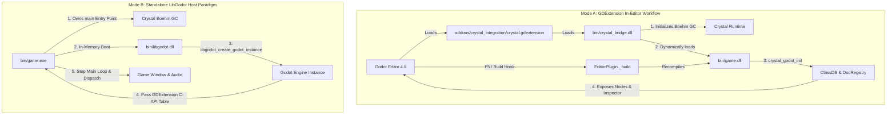

# LibGodot for Crystal

[](https://crystal-lang.org)
[](https://godotengine.org)
[](LICENSE)

**LibGodot for Crystal** provides high-performance Crystal bindings and a bidirectional runtime integration for **Godot Engine 4.8+**. It allows Crystal to be used as a primary game programming language in Godot with native machine speed, complete type safety, and Ruby-like ergonomics.

---

## Architecture: Dual-Paradigm Integration

LibGodot for Crystal supports two distinct execution paradigms designed for both fast in-editor iteration and standalone production shipping:



### 1. GDExtension In-Editor Workflow (`game.dll` + `crystal_bridge.dll`)
- Used when developing within the **Godot Editor** (`make editor`) or launching via Godot's executable (`make run`).
- `crystal_bridge.dll` is a lightweight C++ loader bridge that interfaces with Godot's GDExtension C-API. It boots the Crystal runtime and Boehm GC cleanly on Windows and dynamically loads `game.dll`.
- Nodes, signals, exported properties, and doc comments are registered into Godot's `ClassDB` and `EditorHelp` database, appearing in the **Create New Node** dialog and the **Inspector**.
- The `addons/crystal_integration` plugin intercepts Godot's **Play (F5)** and **Play Scene (F6)** buttons to trigger automatic rebuilds of `game.dll`.

### 2. Standalone LibGodot Host Paradigm (`game.exe` + `libgodot.dll`)
- Crystal compiles as a standard Windows executable (`game.exe`).
- Godot is compiled as a shared library (`libgodot.dll`).
- Crystal owns `main()`, initializes its runtime and Boehm GC natively, and boots Godot in-memory via `libgodot_create_godot_instance()`.
- Godot hands its GDExtension C-API function table directly to Crystal's initialization callback, giving Crystal total control over the main loop and scene lifecycle.

---

## Features

- **Intuitive Node DSL**: Define Godot nodes with concise, expressive `node ClassName < ParentNode do ... end` syntax.
- **Inspector Export System**: Export properties using `@[Export]` with automatic type mapping, numeric ranges, and steps.
- **First-Class Doc Comments**: Standard Crystal comments (`# ...`) above classes, properties, signals, and methods are automatically harvested at compile time and registered into Godot's `EditorHelp` XML documentation.
- **Type-Safe Signals**: Define signals with `signal name(args)` and emit them with generated `emit_<name>(...)` helpers.
- **GDScript Interoperability**: Seamlessly call GDScript instance methods, static functions, and properties via the `bind_gdscript_methods` DSL.
- **Engine Reflection & Global Singletons**: Access singletons like `Godot.input`, `Godot.engine`, `Godot.audio_server`, and full global enums.
- **Cohesive Math & Utility Integration**: Crystal ranges convert directly to Godot ranges via `.to_godot_range()`, along with native `Vector2`, `Vector3`, `Color`, `Basis`, and `Transform3D` types.
- **Strict Library vs. Consumer Separation**: The library (`src/`) is decoupled from consumer games (`demo/` and `template/`).

---

## Quickstart Guide

### 1. Defining Nodes

```crystal
require "libgodot"

# Defaults to inheriting Godot::Node when no parent class is specified
node CameraRig do
  # Camera zoom level
  @[Export(range: 0.5_f32..3.0_f32, step: 0.1_f32)]
  property zoom : Float32 = 1.0_f32
end

# Inherits specified Godot node type
node Player < CharacterBody3D do
  # Movement velocity in meters per second
  @[Export(range: 1.0_f32..20.0_f32, step: 0.5_f32)]
  property speed : Float32 = 6.5_f32

  # Upward impulse applied when jumping
  @[Export(range: 1.0_f32..25.0_f32, step: 0.5_f32)]
  property jump_velocity : Float32 = 7.5_f32

  # Downward gravitational acceleration
  @[Export(range: 1.0_f32..50.0_f32, step: 1.0_f32)]
  property gravity : Float32 = 18.0_f32

  # Maximum player hit points
  @[Export(range: 10..500, step: 10)]
  property max_health : Int32 = 100

  # Current player hit points
  property current_health : Int32 = 100

  # Emitted when the player takes damage or heals
  signal health_changed(new_health : Int32, max_health : Int32)

  # Emitted when player health reaches zero
  signal died

  # Lifecycle: Called when the node enters the scene tree
  def _ready
    @current_health = @max_health
    Godot.print("Player initialized at position: #{position}")
  end

  # Lifecycle: Called every physics processing frame
  def _physics_process(delta : Float64) : Void
    vel = velocity

    unless is_on_floor
      vel.y -= @gravity * delta.to_f32
    end

    if Input.is_action_just_pressed("jump") && is_on_floor
      vel.y = @jump_velocity
    end

    input_dir = Input.get_vector("move_left", "move_right", "move_forward", "move_back")
    direction = (transform.basis * Vector3.new(input_dir.x, 0.0_f32, input_dir.y)).normalized

    if direction.length > 0.001_f32
      vel.x = direction.x * @speed
      vel.z = direction.z * @speed
    else
      vel.x = Math.move_toward(vel.x, 0.0_f32, @speed * delta.to_f32)
      vel.z = Math.move_toward(vel.z, 0.0_f32, @speed * delta.to_f32)
    end

    self.velocity = vel
    move_and_slide
  end

  # Inflicts damage on the player
  def take_damage(amount : Int32) : Void
    return if @current_health <= 0
    @current_health = Math.max(0, @current_health - amount)
    emit_health_changed(@current_health, @max_health)
    if @current_health <= 0
      emit_died
      queue_free
    end
  end
end
```

---

## Export Options & Inspector Reference

The `@[Export]` annotation maps directly to Godot's `PropertyInfo` metadata:

| Type / Feature | Crystal Syntax | Godot Inspector Representation |
| :--- | :--- | :--- |
| **Primitives** | `@[Export] property speed : Float32 = 200.0` | Number input box with type enforcement |
| **Numeric Ranges** | `@[Export(range: 0.0_f32..100.0_f32, step: 0.5_f32)]` | Range slider with defined step interval |
| **Integers** | `@[Export(range: 1..100, step: 1)]` | Integer step slider |
| **Booleans** | `@[Export] property active : Bool = true` | Checkbox toggle |
| **Strings** | `@[Export] property player_name : String = "Hero"` | Text input field |
| **2D / 3D Vectors**| `@[Export] property offset : Vector3 = Vector3.new(0, 1, 0)` | Vector coordinate vector input (`X`, `Y`, `Z`) |
| **Colors** | `@[Export] property tint : Color = Color::WHITE` | Color picker palette |
| **Node Paths** | `@[Export] property target : NodePath = NodePath.new` | Scene tree node selector |

> [!NOTE]
> Properties without `@[Export]` receive `PROPERTY_USAGE_STORAGE`. They participate in object state serialization without cluttering the Godot Editor Inspector.

---

## Doc Comments & Editor Help XML

LibGodot automatically extracts doc comments and generates standard Godot Editor documentation:

```crystal
# Collectible item that rotates and bobs vertically in 3D space
node SpinningCrystal < Area3D do
  # Rotation rate in radians per second
  @[Export(range: 0.1_f32..10.0_f32, step: 0.1_f32)]
  property rotation_speed : Float32 = 2.5_f32

  # Score value awarded when collected
  @[Export(range: 10..1000, step: 10)]
  property score_value : Int32 = 100

  # Emitted when a character collects this crystal
  signal crystal_collected(value : Int32)

  # Resets the crystal back to its uncollected state
  def reset! : Void
    @collected = false
    self.scale = Vector3.new(1.0_f32, 1.0_f32, 1.0_f32)
  end
end
```

### How It Works:
1. At compile time, the `node` macro reads the caller file (`block.filename`) and extracts doc comments (`# ...`) above the class, properties, signals, and methods.
2. An XML document matching Godot's `DocData` specification is generated in memory:
   ```xml
   <?xml version="1.0" encoding="UTF-8" ?>
   <class name="SpinningCrystal" inherits="Area3D">
     <brief_description>Collectible item that rotates and bobs vertically in 3D space</brief_description>
     <description>Collectible item that rotates and bobs vertically in 3D space</description>
     <members>
       <member name="rotation_speed" type="float" setter="" getter="">Rotation rate in radians per second</member>
       <member name="score_value" type="int" setter="" getter="">Score value awarded when collected</member>
     </members>
     <signals>
       <signal name="crystal_collected">
         <param index="0" name="value" type="int" />
         <description>Emitted when a character collects this crystal</description>
       </signal>
     </signals>
     <methods>
       <method name="reset!">
         <description>Resets the crystal back to its uncollected state</description>
       </method>
     </methods>
   </class>
   ```
3. During engine initialization, `EditorDocRegistry.load_all` passes the accumulated XML documents directly to Godot's `EditorHelp` subsystem via `GDExtensionEditorHelp::load_xml_buffer`.
4. In the Godot Editor, hovering over properties displays rich tooltips, and pressing **F1** opens the full offline documentation page for your custom Crystal classes.

---

## GDScript Interoperability

You can call GDScript functions and access script properties directly from Crystal:

```crystal
node CompanionController < Node do
  bind_gdscript_methods do
    gdscript_method calculate_bonus(score : Int32)
    gdscript_static_method get_system_status
    gdscript_method cheer(score : Int32)
    gdscript_property bonus_multiplier : Float32
  end

  def _ready
    # Call GDScript instance methods
    calculate_bonus(100)
    cheer(500)

    # Call GDScript static methods
    status = CompanionController.get_system_status
    Godot.print("Status from GDScript: #{status}")
  end
end
```

---

## Repository Structure

```
libgodot/
├── src/                          # Reusable LibGodot library (STRICTLY decoupled)
│   ├── libgodot.cr               # Library root entry point
│   ├── bridge/crystal_bridge.cpp # C++ GDExtension loader bridge
│   └── libgodot/
│       ├── macros.cr             # DSL macros (node, signal, export, doc parsing)
│       ├── bridge.cr             # C-API bindings & GDExtension interface
│       ├── core.cr               # Core Object, ClassDB, PropertyInfo, SignalInfo
│       ├── doc_macro.cr          # EditorDocRegistry & DocData XML loader
│       ├── gdscript_interop.cr   # GDScript bridge macro DSL
│       ├── singletons.cr         # Godot engine singletons
│       └── generated/            # Complete generated Godot class bindings
├── demo/                         # Standalone 3D interactive showcase project
│   ├── project.godot             # Godot project configuration
│   ├── main.tscn                 # Main 3D scene (character, arena, crystals, HUD)
│   ├── src/main.cr               # Demo game logic (DemoCharacter, SpinningCrystal, etc.)
│   └── Makefile                  # Consumer demo build script
├── template/                     # Clean starter template for new game projects
│   ├── project.godot             # Godot project configuration
│   ├── src/main.cr               # Clean starter node (MainNode)
│   └── Makefile                  # Template build script
├── addons/                       # Godot editor integration plugin
│   └── crystal_integration/      # GDExtension manifest and F5 build interception hook
├── bin/                          # Output binaries, bridge DLL, and runtime dependencies
├── spec/                         # Automated test suite and verification specs
├── Makefile                      # Root build system orchestration
└── AGENTS.md                     # Agent development guidelines and separation rules
```

> [!IMPORTANT]
> In accordance with [AGENTS.md](file:///c:/Users/Ian/Documents/libgodot/AGENTS.md), `src/` contains only generic, reusable library bindings. All game logic, sample nodes, and application entry points reside in `demo/` or `template/`.

---

## Build System & Commands

The root `Makefile` orchestrates compilation across the bridge, demo, template, and dependencies.

### Command Reference

| Command | Description |
| :--- | :--- |
| `make` / `make all` | Complete build: compiles bridge DLL, builds demo & template projects, syncs DLLs and addons. |
| `make run` | Launches the 3D demo game directly via `godot.exe --path demo`. |
| `make editor` | Opens the demo project inside the Godot Editor (`godot.exe --editor --path demo`). |
| `make bridge` | Compiles `src/bridge/crystal_bridge.cpp` into `bin/crystal_bridge.dll`. |
| `make demo` | Compiles the demo consumer project (`demo/bin/game.dll`). |
| `make template` | Compiles the starter template project (`template/bin/game.dll`). |
| `make game_exe` | Compiles standalone host executable `bin/game.exe` for the LibGodot paradigm. |
| `make deps` | Copies Crystal runtime DLLs (`gc.dll`, `iconv-2.dll`, `pcre2-8.dll`) and `libgodot.dll` to all bin folders. |
| `make sync` | Synchronizes binaries, addons, and extension configurations across all consumer directories. |
| `make engine` | Recompiles Godot Engine shared library (`libgodot.dll`) from `godot-src/` using SCons. |
| `make test` | Runs the automated specification suite (`libgodot_spec`, `boot_spec`, `features_spec`) and headless smoke tests. |
| `make docs` | Generates offline HTML documentation via `crystal docs src/libgodot.cr` into `docs/`. |
| `make clean` | Removes compiled binaries and intermediate build artifacts while preserving runtime DLLs. |

### Build Flags & Options

- `RELEASE=1`: Compiles Crystal code with optimizations enabled (`--release -O3`).
- `CXX=<compiler>`: Sets the C++ compiler for the bridge (default: `g++`).
- `ENTRY=<path>`: Customizes the Crystal entry point file (default: `demo/src/main.cr`).
- `SCONS_JOBS=<N>`: Number of parallel jobs when rebuilding the engine via `make engine` (default: `7`).

---

## Godot Editor Workflow

1. Open the project in the editor:
   ```bash
   make editor
   ```
2. Modify Crystal source files in `demo/src/main.cr` or your project source.
3. Press **Play Project (F5)** or **Play Scene (F6)** inside Godot.
4. The `addons/crystal_integration` plugin intercepts the build hook, compiles `game.dll`, and reloads the extension automatically.
5. If compilation errors occur, they are reported directly in Godot's Output / Debugger dock.

---

## Starting a New Game Project

To start a new game using LibGodot:

1. Copy the `template/` directory:
   ```bash
   cp -r template my_game
   ```
2. Navigate to your new project and build:
   ```bash
   cd my_game
   make
   ```
3. Launch your game or open it in the editor:
   ```bash
   make run      # Run game
   make editor   # Open Godot editor
   ```
4. Define your game nodes in `my_game/src/main.cr`.

---

## Documentation

Generate the full offline HTML API documentation:

```bash
make docs
```

Then open `docs/index.html` in your web browser.

---

## License

Distributed under the MIT License. Copyright (c) 2026 Ian and contributors.
