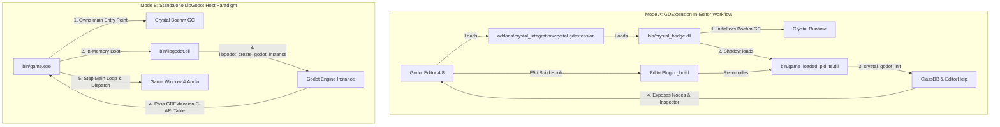

# LibGodot for Crystal

[](https://crystal-lang.org)
[](https://godotengine.org)
[](LICENSE)

**LibGodot for Crystal** provides high-performance Crystal bindings and a bidirectional runtime integration for **Godot Engine 4.8+**. It empowers game developers to write Godot games with native machine speed, complete compile-time type safety, and Ruby-like elegance.

---

## Architecture: Dual-Paradigm Integration

LibGodot supports two distinct execution paradigms designed for both rapid in-editor iteration and lean standalone production shipping:



- **Mode A: GDExtension In-Editor Workflow (`game.dll` + `crystal_bridge.dll`)**:
  Develop inside the Godot Editor (`make editor`). The native C++ bridge boots the Boehm GC and shadow-copies `game.dll` to prevent Windows file locking. Pressing **F5** in the editor triggers live compilation and reload.
- **Mode B: Standalone LibGodot Host Paradigm (`game.exe` + `libgodot.dll`)**:
  Crystal owns `main()`, initializes its runtime natively, boots Godot in-memory, and controls the main loop for standalone shipping builds (`make game_exe`).

> Detailed architectural deep-dive is available in [`Docs::A_ARCHITECTURE`](src/libgodot/docs.cr) and [`Docs::B_COMPILATION_AND_BUILD`](src/libgodot/docs.cr).

---

## Features

- **Intuitive Node DSL**: Define Godot nodes with concise `node ClassName < ParentNode do ... end` syntax.
- **Inspector Export System**: Complete support for `@[Export]`, numeric ranges, enums, file pickers, bitmask flags, groups, categories, and tool buttons.
- **Automated Doc Comment Harvesting**: Standard Crystal `# comments` above classes, properties, signals, and methods are extracted at compile time and registered into Godot's `EditorHelp` XML database for in-editor tooltips and offline F1 Help.
- **Type-Safe Signals**: Declare signals via `signal health_changed(new_health : Int32)` with generated `emit_<signal>` helpers.
- **GDScript Interoperability**: Call GDScript methods, static functions, and properties directly via `bind_gdscript_methods`.
- **Engine Reflection & Global Singletons**: First-class access to singletons like `Godot.input`, `Godot.engine`, `Godot.audio_server`, and generated Godot classes.
- **Strict Decoupling**: Clean separation between reusable library (`src/`), test suite (`test/`), and examples (`examples/`).

---

## Quickstart

```crystal
require "libgodot"

# Player character with physics movement, health tracking, and signals
node Player < CharacterBody3D do
  # Movement speed in meters per second
  @[Export(range: 1.0_f32..20.0_f32, step: 0.5_f32)]
  property speed : Float32 = 7.0_f32

  # Jump velocity impulse
  @[Export(range: 1.0_f32..25.0_f32, step: 0.5_f32)]
  property jump_velocity : Float32 = 8.0_f32

  # Gravitational acceleration
  @[Export(range: 1.0_f32..50.0_f32, step: 1.0_f32)]
  property gravity : Float32 = 18.0_f32

  # Maximum hit points
  @[Export(range: 10..500, step: 10)]
  property max_health : Int32 = 100

  # Emitted when the player's health changes
  signal health_changed(current : Int32, max_health : Int32)

  # Emitted when the player dies
  signal died

  # Called when node enters the active scene tree
  def _ready : Void
    @current_health = @max_health
    Godot.print("Player initialized at #{position}")
  end

  # Called every fixed physics step
  def _physics_process(delta : Float64) : Void
    vel = velocity

    unless is_on_floor
      vel.y -= @gravity * delta.to_f32
    end

    if Input.is_action_just_pressed("jump") && is_on_floor
      vel.y = @jump_velocity
    end

    input_dir = Input.get_vector("move_left", "move_right", "move_forward", "move_back")
    direction = (transform.basis * Vector3.new(input_dir.x, 0.0_f32, input_dir.y)).normalized

    if direction.length > 0.001_f32
      vel.x = direction.x * @speed
      vel.z = direction.z * @speed
    else
      vel.x = Math.move_toward(vel.x, 0.0_f32, @speed * delta.to_f32)
      vel.z = Math.move_toward(vel.z, 0.0_f32, @speed * delta.to_f32)
    end

    self.velocity = vel
    move_and_slide
  end

  # Inflicts damage on the player
  def take_damage(amount : Int32) : Void
    return if @current_health <= 0
    @current_health = Math.max(0, @current_health - amount)
    emit_health_changed(@current_health, @max_health)
    if @current_health <= 0
      emit_died
      queue_free
    end
  end
end
```

---

## Comprehensive In-Code Documentation (`Docs` Module)

LibGodot features an extensive in-code documentation suite under the `Docs` module. Each submodule details internal mechanics, macro pipelines, export options, and engine caveats:

| Submodule | Topic |
| :--- | :--- |
| [`Docs::A_ARCHITECTURE`](src/libgodot/docs.cr) | Dual-paradigm model, GDExtension Mode A vs Standalone LibGodot Mode B. |
| [`Docs::B_COMPILATION_AND_BUILD`](src/libgodot/docs.cr) | Bridge compilation, Windows shadow DLL file-locking bypass, F5 editor hook, and `Makefile` orchestration. |
| [`Docs::C_EXPORTS_AND_INSPECTOR`](src/libgodot/docs.cr) | All `@[Export*]` annotations, `PropertyInfo` mapping, ranges, enums, flags, categories, and buttons. |
| [`Docs::D_NODE_DSL_AND_SIGNALS`](src/libgodot/docs.cr) | Node macro DSL, lifecycle callbacks (`_ready`, `_physics_process`), signal registration, and scene APIs. |
| [`Docs::E_DOC_COMMENTS_AND_HELP`](src/libgodot/docs.cr) | Compile-time doc comment harvesting, `DocData` XML generation, and Godot offline F1 Help integration. |
| [`Docs::F_GDSCRIPT_INTEROP`](src/libgodot/docs.cr) | The `bind_gdscript_methods` DSL and Variant marshaling. |
| [`Docs::G_CAVEATS_AND_INTERNALS`](src/libgodot/docs.cr) | Boehm GC vs Godot memory lifecycles, threading rules, method bind caching, and Windows toolchains. |

To generate and browse the complete HTML documentation locally:
```bash
make docs
```
Then open `docs/index.html` in your browser.

---

## Build System & Commands

Build operations are orchestrated through the root `Makefile`.

| Command | Description |
| :--- | :--- |
| `make all` | **Default Build**: Compiles loader bridge, test project, examples, template, and synchronizes all DLLs. |
| `make run` | Launches the test suite project directly in the Godot engine. |
| `make editor` | Opens the test project in the Godot Editor (`godot.exe --editor --path test`). |
| `make test` | Runs the automated Crystal specification suite (`spec/`). |
| `make docs` | Generates offline HTML documentation into `docs/`. |
| `make bridge` | Compiles `src/bridge/crystal_bridge.cpp` into `bin/crystal_bridge.dll`. |
| `make test_project` | Compiles the test suite project (`test/bin/game.dll`). |
| `make examples` | Compiles all showcase projects in `examples/`. |
| `make template` | Compiles the starter template (`template/bin/game.dll`). |
| `make game_exe` | Compiles standalone host executable `bin/game.exe` (Mode B). |
| `make sync` | Synchronizes binaries, runtime DLLs, and addons across all consumer directories. |
| `make clean` | Removes compiled binaries and intermediate build artifacts while preserving runtime DLLs. |

### Build Options
- `RELEASE=1`: Compiles Crystal code with release optimizations (`--release -O3`).
- `ENTRY=<path>`: Customizes the Crystal entry file (default: `test/src/main.cr`).
- `CXX=<compiler>`: Specifies C++ compiler for the bridge (default: `g++`).

---

## Repository Structure

```
libgodot/
├── src/                          # Reusable LibGodot library (STRICTLY decoupled)
│   ├── libgodot.cr               # Library entry point
│   ├── bridge/crystal_bridge.cpp # C++ GDExtension loader bridge
│   └── libgodot/
│       ├── docs.cr               # Comprehensive Docs module (A-G guides)
│       ├── macros.cr             # Node DSL, signal, export, and doc harvesting macros
│       ├── bridge.cr             # C-API bindings & GDExtension interface table
│       ├── core.cr               # Object, ClassDB, PropertyInfo, SignalInfo
│       ├── doc_macro.cr          # EditorDocRegistry & XML loader
│       ├── gdscript.cr           # GDScript interop bindings
│       └── generated/            # Complete generated Godot engine class bindings
├── test/                         # Dedicated verification and test project
├── examples/                     # Independent consumer showcase examples
├── template/                     # Clean starter template for new games
├── addons/crystal_integration/   # Godot editor extension manifest & build hook
├── bin/                          # Output binaries, bridge DLL, and dependencies
├── spec/                         # Automated unit specifications
└── AGENTS.md                     # Agent development guidelines
```

---

## License

Distributed under the MIT License. Copyright (c) 2026 Ian and contributors.
