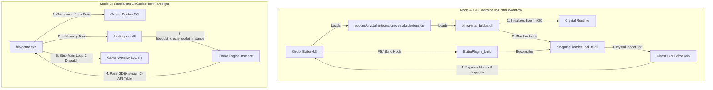

# LibGodot for Crystal

[](https://crystal-lang.org)
[](https://godotengine.org)
[](https://sol-vin.github.io/libgodot/)
[](LICENSE)

**LibGodot for Crystal** provides high-performance Crystal bindings and a bidirectional runtime integration for **Godot Engine 4.8+**. It empowers game developers to write Godot games with native machine speed, complete compile-time type safety, and Ruby-like elegance.

---

## Architecture: Dual-Paradigm Integration

LibGodot supports two distinct execution paradigms designed for both rapid in-editor iteration and lean standalone production shipping:



- **Mode A: GDExtension In-Editor Workflow (`game.dll` + `crystal_bridge.dll`)**:
  Develop inside the Godot Editor (`make editor`). The native C++ bridge boots the Boehm GC and shadow-copies `game.dll` to prevent Windows file locking. Pressing **F5** in the editor triggers live compilation and reload.
- **Mode B: Standalone LibGodot Host Paradigm (`game.exe` + `libgodot.dll`)**:
  Crystal owns `main()`, initializes its runtime natively, boots Godot in-memory, and controls the main loop for standalone shipping builds (`make game_exe`).

> Detailed architectural deep-dive is available in [`Docs::A_ARCHITECTURE`](src/libgodot/docs.cr) and [`Docs::B_COMPILATION_AND_BUILD`](src/libgodot/docs.cr).

---

## Features

- **Intuitive Node DSL**: Define Godot nodes with concise `node ClassName < ParentNode do ... end` syntax.
- **Inspector Export System**: Complete support for `@[Export]`, numeric ranges, enums, file pickers, bitmask flags, groups, categories, and tool buttons.
- **Automated Doc Comment Harvesting**: Standard Crystal `# comments` above classes, properties, signals, and methods are extracted at compile time and registered into Godot's `EditorHelp` XML database for in-editor tooltips and offline F1 Help.
- **Type-Safe Signals**: Declare signals via `signal health_changed(new_health : Int32)` with generated `emit_<signal>` helpers.
- **GDScript Interoperability**: Call GDScript methods, static functions, and properties directly via `bind_gdscript_methods`.
- **Engine Reflection & Global Singletons**: First-class access to singletons like `Godot.input`, `Godot.engine`, `Godot.audio_server`, and generated Godot classes.
- **Strict Decoupling**: Clean separation between reusable library (`src/`), test suite (`test/`), and examples (`examples/`).

---

## Documentation

- **Official Online Documentation Site**: [https://sol-vin.github.io/libgodot/](https://sol-vin.github.io/libgodot/)
- **Architecture & Guides in `Docs` Module**: Complete guides covering architecture, build toolchains, memory management, and concurrency are contained in [`Docs`](src/libgodot/docs.cr) (such as [`Docs::I_CONCURRENCY_FIBERS_AND_THREAD_SAFETY`](src/libgodot/docs.cr)).
- **Offline HTML API Documentation**: Generate complete API documentation locally with `make docs` (output at `docs/index.html`).
- **In-Editor Help**: Class and method descriptions are harvested at compile time and accessible directly inside Godot via `F1` or Inspector tooltips.

---

## Quickstart

```crystal
require "libgodot"

# Player character with physics movement, health tracking, and signals
node Player < CharacterBody3D do
  # Movement speed in meters per second
  @[Export(range: 1.0_f32..20.0_f32, step: 0.5_f32)]
  property speed : Float32 = 7.0_f32

  # Jump velocity impulse
  @[Export(range: 1.0_f32..25.0_f32, step: 0.5_f32)]
  property jump_velocity : Float32 = 8.0_f32

  # Gravitational acceleration
  @[Export(range: 1.0_f32..50.0_f32, step: 1.0_f32)]
  property gravity : Float32 = 18.0_f32

  # Maximum hit points
  @[Export(range: 10..500, step: 10)]
  property max_health : Int32 = 100

  # Emitted when the player's health changes
  signal health_changed(current : Int32, max_health : Int32)

  # Emitted when the player dies
  signal died

  # Called when node enters the active scene tree
  def _ready : Void
    @current_health = @max_health
    Godot.print("Player initialized at #{position}")
  end

  # Called every fixed physics step
  def _physics_process(delta : Float64) : Void
    vel = velocity

    unless is_on_floor
      vel.y -= @gravity * delta.to_f32
    end

    if Input.is_action_just_pressed("jump") && is_on_floor
      vel.y = @jump_velocity
    end

    input_dir = Input.get_vector("move_left", "move_right", "move_forward", "move_back")
    direction = (transform.basis * Vector3.new(input_dir.x, 0.0_f32, input_dir.y)).normalized

    if direction.length > 0.001_f32
      vel.x = direction.x * @speed
      vel.z = direction.z * @speed
    else
      vel.x = Math.move_toward(vel.x, 0.0_f32, @speed * delta.to_f32)
      vel.z = Math.move_toward(vel.z, 0.0_f32, @speed * delta.to_f32)
    end

    self.velocity = vel
    move_and_slide
  end

  # Inflicts damage on the player
  def take_damage(amount : Int32) : Void
    return if @current_health <= 0
    @current_health = Math.max(0, @current_health - amount)
    emit_health_changed(@current_health, @max_health)
    if @current_health <= 0
      emit_died
      queue_free
    end
  end
end
```

---

## Comprehensive In-Code Documentation (`Docs` Module)

LibGodot features an extensive in-code documentation suite under the `Docs` module. Each submodule details internal mechanics, macro pipelines, export options, and engine caveats:

<table>
  <thead>
    <tr>
      <th align="left">Submodule</th>
      <th align="left">Topic</th>
    </tr>
  </thead>
  <tbody>
    <tr>
      <td><a href="src/libgodot/docs.cr"><code>Docs::A_ARCHITECTURE</code></a></td>
      <td>Dual-paradigm model, GDExtension Mode A vs Standalone LibGodot Mode B.</td>
    </tr>
    <tr>
      <td><a href="src/libgodot/docs.cr"><code>Docs::B_COMPILATION_AND_BUILD</code></a></td>
      <td>Bridge compilation, Windows shadow DLL file-locking bypass, F5 editor hook, and <code>Makefile</code> orchestration.</td>
    </tr>
    <tr>
      <td><a href="src/libgodot/docs.cr"><code>Docs::C_EXPORTS_AND_INSPECTOR</code></a></td>
      <td>All <code>@[Export*]</code> annotations, <code>PropertyInfo</code> mapping, ranges, enums, flags, categories, and buttons.</td>
    </tr>
    <tr>
      <td><a href="src/libgodot/docs.cr"><code>Docs::D_NODE_DSL_AND_SIGNALS</code></a></td>
      <td>Node macro DSL, lifecycle callbacks (<code>_ready</code>, <code>_physics_process</code>), signal registration, and scene APIs.</td>
    </tr>
    <tr>
      <td><a href="src/libgodot/docs.cr"><code>Docs::E_DOC_COMMENTS_AND_HELP</code></a></td>
      <td>Compile-time doc comment harvesting, <code>DocData</code> XML generation, and Godot offline F1 Help integration.</td>
    </tr>
    <tr>
      <td><a href="src/libgodot/docs.cr"><code>Docs::F_GDSCRIPT_INTEROP</code></a></td>
      <td>The <code>bind_gdscript_methods</code> DSL and Variant marshaling.</td>
    </tr>
    <tr>
      <td><a href="src/libgodot/docs.cr"><code>Docs::G_CAVEATS_AND_INTERNALS</code></a></td>
      <td>Boehm GC vs Godot memory lifecycles, threading rules, method bind caching, and Windows toolchains.</td>
    </tr>
    <tr>
      <td><a href="src/libgodot/docs.cr"><code>Docs::H_LIFECYCLE_MEMORY_AND_DEAD_POINTER_SAFETY</code></a></td>
      <td>Dead-pointer prevention, monotonic 64-bit instance IDs, O(1) liveness checks, and zero-crash <code>DisposedObjectError</code>.</td>
    </tr>
    <tr>
      <td><a href="src/libgodot/docs.cr"><code>Docs::I_CONCURRENCY_FIBERS_AND_THREAD_SAFETY</code></a></td>
      <td>Crystal fibers, background OS threads, actor channel message passing, mutexes, and main-thread SceneTree affinity.</td>
    </tr>
  </tbody>
</table>

To generate and browse the complete HTML documentation locally:
```bash
make docs
```
Then open `docs/index.html` in your browser.

---

## Build System & Commands

Build operations are orchestrated through the root `Makefile`.

<table>
  <thead>
    <tr>
      <th align="left">Command</th>
      <th align="left">Description</th>
    </tr>
  </thead>
  <tbody>
    <tr>
      <td><code>make all</code></td>
      <td><strong>Default Build</strong>: Compiles loader bridge, test project, examples, template, and synchronizes all DLLs.</td>
    </tr>
    <tr>
      <td><code>make run</code></td>
      <td>Launches the test suite project directly in the Godot engine.</td>
    </tr>
    <tr>
      <td><code>make editor</code></td>
      <td>Opens the test project in the Godot Editor (<code>godot.exe --editor --path test</code>).</td>
    </tr>
    <tr>
      <td><code>make test</code></td>
      <td>Runs the automated Crystal specification suite (<code>spec/</code>).</td>
    </tr>
    <tr>
      <td><code>make docs</code></td>
      <td>Generates offline HTML documentation into <code>docs/</code>.</td>
    </tr>
    <tr>
      <td><code>make bridge</code></td>
      <td>Compiles <code>src/bridge/crystal_bridge.cpp</code> into <code>bin/crystal_bridge.dll</code>.</td>
    </tr>
    <tr>
      <td><code>make test_project</code></td>
      <td>Compiles the test suite project (<code>test/bin/game.dll</code>).</td>
    </tr>
    <tr>
      <td><code>make examples</code></td>
      <td>Compiles all showcase projects in <code>examples/</code>.</td>
    </tr>
    <tr>
      <td><code>make template</code></td>
      <td>Compiles the starter template (<code>template/bin/game.dll</code>).</td>
    </tr>
    <tr>
      <td><code>make game_exe</code></td>
      <td>Compiles standalone host executable <code>bin/game.exe</code> (Mode B).</td>
    </tr>
    <tr>
      <td><code>make sync</code></td>
      <td>Synchronizes binaries, runtime DLLs, and addons across all consumer directories.</td>
    </tr>
    <tr>
      <td><code>make clean</code></td>
      <td>Removes compiled binaries and intermediate build artifacts while preserving runtime DLLs.</td>
    </tr>
  </tbody>
</table>

### Build Options
- `RELEASE=1`: Compiles Crystal code with release optimizations (`--release -O3`).
- `ENTRY=<path>`: Customizes the Crystal entry file (default: `test/src/main.cr`).
- `CXX=<compiler>`: Specifies C++ compiler for the bridge (default: `g++`).

---

## Memory Safety, Object Lifecycle & Dead-Pointer Protection

Developing with a garbage-collected language like Crystal embedded inside a native C++ engine like Godot introduces a dual memory model hazard:
- **Crystal Boehm GC**: Manages Crystal heap objects and node wrappers (`Godot::Object`).
- **Godot ObjectDB & Reference Counting**: Manages native C++ engine nodes and refcounted resources.

### The Dangling Pointer Hazard in Cross-Language Bindings
When an object is freed on the Godot engine side or via GDScript (e.g. `queue_free()` or `target.free()`), standard C-API bindings retain a raw C++ pointer to dead memory. Subsequent operations (e.g. `target.position = new_pos`) dereference the unmapped address, triggering an immediate, fatal **segmentation fault (`ACCESS_VIOLATION / SIGSEGV`)** that crashes the game process with no traceback.

```
[ Crystal Runtime ]                          [ Godot Engine / GDScript ]
  enemy = get_node("Enemy")
  enemy.@pointer = 0x7FFE_1234  -------->     Node instance at 0x7FFE_1234
                                                  |
                                                  | GDScript: enemy.queue_free()
                                                  v
                                               ObjectDB destroys Node & frees memory!
                                               0x7FFE_1234 is now DEAD / UNMAPPED!
  enemy.position = Vector2.new(...)
        |
        v
  [ LibGodot check_alive! ]
        |
        +---> Query ObjectDB for 64-bit instance ID: ID is INVALID!
        |
        +---> Marks wrapper dead (@pointer = null)
        |
        +---> Raises Godot::DisposedObjectError (Clean, catchable Crystal exception!)
              [ ZERO NATIVE CRASHES! ]
```

### How LibGodot Guarantees Dead-Pointer Safety
1. **Monotonic 64-bit Instance ID Tracking**:
   Every `Godot::Object` wrapper tracks its engine-assigned `instance_id`. Because Godot's `ObjectDB` generates monotonic 64-bit IDs, newly allocated heap objects will never collide with previously freed IDs.
2. **Pre-Dispatch Liveness Check (`#check_alive!`)**:
   Before executing method dispatches or reflection calls, LibGodot queries Godot's ObjectDB in O(1) time (`Bridge.is_instance_valid(instance_id)`).
3. **Graceful `DisposedObjectError` Exception**:
   If an object was destroyed by GDScript, the engine, or Crystal, LibGodot marks the pointer null and immediately raises `Godot::DisposedObjectError`:
   ```crystal
   begin
     enemy.position = Vector2.new(10.0, 20.0)
   rescue ex : Godot::DisposedObjectError
     Godot.print_warn "Attempted operation on dead node (ID: #{ex.instance_id})"
   end
   ```
4. **Defensive Inspection with `#alive?` and `#destroyed?`**:
   Game logic can check entity liveness before issuing operations:
   ```crystal
   if target.alive?
     target.apply_damage(50)
   else
     active_targets.delete(target)
   end
   ```

### Quantitative Zero-Leak Verification
LibGodot's test suite integrates Godot's `Performance` singleton monitors (`OBJECT_COUNT`, `OBJECT_NODE_COUNT`, `MEMORY_STATIC`) and Crystal's `GC.collect` to mathematically verify that creating, reparenting, and destroying nodes across hundreds of iterations leaves **zero memory leaks** in both Godot's ObjectDB and Crystal's heap.

---

## Repository Structure

```
libgodot/
├── src/                          # Reusable LibGodot library (STRICTLY decoupled)
│   ├── libgodot.cr               # Library entry point
│   ├── bridge/crystal_bridge.cpp # C++ GDExtension loader bridge
│   └── libgodot/
│       ├── docs.cr               # Comprehensive Docs module (A-G guides)
│       ├── macros.cr             # Node DSL, signal, export, and doc harvesting macros
│       ├── bridge.cr             # C-API bindings & GDExtension interface table
│       ├── core.cr               # Object, ClassDB, PropertyInfo, SignalInfo
│       ├── doc_macro.cr          # EditorDocRegistry & XML loader
│       ├── gdscript.cr           # GDScript interop bindings
│       └── generated/            # Complete generated Godot engine class bindings
├── test/                         # Dedicated verification and test project
├── examples/                     # Independent consumer showcase examples
├── template/                     # Clean starter template for new games
├── addons/crystal_integration/   # Godot editor extension manifest & build hook
├── bin/                          # Output binaries, bridge DLL, and dependencies
├── spec/                         # Automated unit specifications
└── AGENTS.md                     # Agent development guidelines
```

---

## License

Distributed under the MIT License. Copyright (c) 2026 Ian and contributors.
