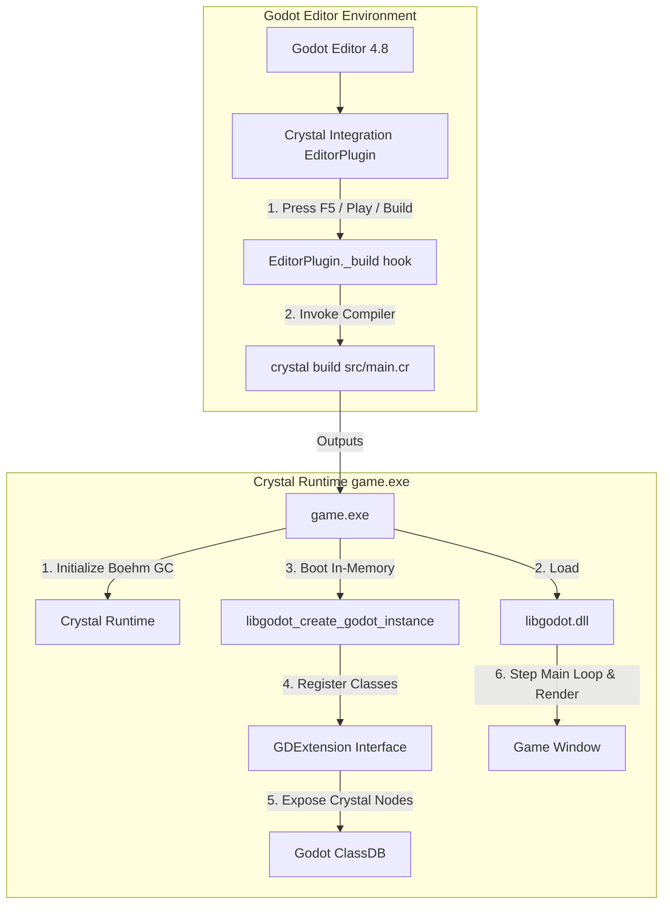

# LibGodot for Crystal

[](https://crystal-lang.org)
[](https://godotengine.org)
[](LICENSE)

**LibGodot for Crystal** provides high-performance Crystal bindings and a 2-way host language integration for **Godot Engine 4.8+**. It allows Crystal to be used as a primary game programming language in Godot with native speed, full type safety, and Ruby-like ergonomics.

---

## Architecture: The LibGodot Host Paradigm



### Why LibGodot (Option C)?
Unlike traditional GDExtension plugins where Godot dynamically loads a foreign `.dll` into its process (which encounters severe MSVCRT and Boehm GC heap constraints on Windows), **LibGodot flips the hierarchy**:
- **Crystal compiles as a standard Windows executable (`game.exe`)**.
- Godot is compiled as a shared library (`libgodot.dll`).
- Crystal owns `main()`, initializes its runtime and Boehm GC cleanly, and boots Godot in-memory via `libgodot_create_godot_instance`.
- Godot passes its GDExtension C-API table to Crystal's initialization callback, enabling two-way class registration, signals, properties, and scene tree dispatching.

---

## Quickstart

### 1. Defining Nodes

Use the clean, DSL-like `node` and `signal` macros without verbose prefixes:

```crystal
require "libgodot"

# Defaults to inheriting Godot::Node
node CameraRig do
  property zoom : Float32 = 1.0_f32
end

# Inherits specified Godot node type
node Player < CharacterBody3D do
  # Exported properties (editable in Godot Editor Inspector)
  @[Export(range: 50.0_f32..800.0_f32, step: 10.0_f32)]
  property speed : Float32 = 300.0_f32

  @[Export(range: 100.0_f32..1000.0_f32, step: 25.0_f32)]
  property jump_velocity : Float32 = 450.0_f32

  @[Export]
  property max_health : Int32 = 100

  # Signals
  signal health_changed(new_health : Int32, max_health : Int32)
  signal died

  # Lifecycle: Node enters scene tree
  def _ready
    puts "Player initialized in scene tree at: #{global_position}"
  end

  # Lifecycle: Physics tick
  def _physics_process(delta : Float64) : Void
    vel = velocity

    unless is_on_floor
      vel.y -= 980.0_f32 * delta.to_f32
    end

    if Input.is_action_just_pressed("jump") && is_on_floor
      vel.y = @jump_velocity
    end

    input_dir = Input.get_vector("move_left", "move_right", "move_forward", "move_back")
    direction = (transform.basis * Vector3.new(input_dir.x, 0.0_f32, input_dir.y)).normalized

    if direction.length > 0.001_f32
      vel.x = direction.x * @speed
      vel.z = direction.z * @speed
    else
      vel.x = Math.move_toward(vel.x, 0.0_f32, @speed * delta.to_f32)
      vel.z = Math.move_toward(vel.z, 0.0_f32, @speed * delta.to_f32)
    end

    self.velocity = vel
    move_and_slide
  end

  def take_damage(amount : Int32) : Void
    return if @max_health <= 0
    @max_health = Math.max(0, @max_health - amount)
    emit_health_changed(@max_health, 100)
    if @max_health <= 0
      emit_died
      queue_free
    end
  end
end
```

---

## Export Options Reference

`@[Export]` maps directly to Godot's `PropertyHint` metadata:

| Feature | Crystal Syntax | Godot Inspector Representation |
| :--- | :--- | :--- |
| **Primitives** | `@[Export] property speed : Float32 = 200.0` | Number input with type enforcement |
| **Numeric Ranges** | `@[Export(range: 0.0_f32..100.0_f32, step: 0.5_f32)]` | Range slider with step size |
| **Sliders** | `@[Export(range: 1..10, slider: true)]` | Drag slider |
| **Enums** | `@[Export] property elem : Element = Element::Fire` | Dropdown menu |
| **Bitflags / Layers** | `@[Export] property mask : CollisionLayers` | Multi-select checkbox matrix |
| **Resource Pickers** | `@[Export] property tex : Texture2D?` | Resource drag-and-drop slot |
| **Node Paths** | `@[Export(node_type: "Camera3D")] property cam : NodePath?` | Scene tree node picker |
| **File Pickers** | `@[Export(file: "*.png,*.jpg")] property icon : String` | File open dialog |
| **Directory Pickers**| `@[Export(dir: true)] property path : String` | Directory picker dialog |
| **Colors** | `@[Export] property tint : Color = Color::WHITE` | Color picker widget |
| **Multiline Text** | `@[Export(multiline: true)] property story : String` | Multi-line text edit area |
| **Typed Arrays** | `@[Export] property points : Array(Vector3)` | Dynamic expandable list |
| **Groups & Subgroups**| `export_group "Combat", prefix: "combat_"` | Collapsible section headers |

---

## Hooking Godot's Compile Button

To enable seamless iteration inside the Godot Editor:
1. When you press **Play Project (F5)** or **Play Scene (F6)**, Godot invokes `_build()` on active editor plugins.
2. The `addons/crystal_integration` plugin intercepts this hook and runs:
   ```bash
   crystal build src/main.cr -o bin/game.exe
   ```
3. If compilation succeeds, Godot launches `bin/game.exe` with scene arguments. If compilation fails, errors are surfaced directly in Godot's Output / Debugger dock.

---

## Documentation

Generate the full offline HTML API documentation and guides:

```bash
crystal docs src/libgodot.cr
```

Then open `docs/index.html` in your web browser.

---

## License

MIT License. Copyright (c) 2026 Ian and contributors.
